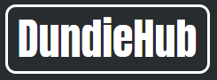

<a name="readme-top"></a>

<!-- PROJECT SHIELDS -->
<!--
*** I'm using markdown "reference style" links for readability.
*** Reference links are enclosed in brackets [ ] instead of parentheses ( ).
*** See the bottom of this document for the declaration of the reference variables
*** for forks-url, LinkedIn-url, etc. This is an optional, concise syntax you may use.
*** https://www.markdownguide.org/basic-syntax/#reference-style-links
-->
[![Forks][forks-shield]][forks-url]
[![Stargazers][stars-shield]][stars-url]
[![LinkedIn][linkedin-shield]][linkedin-url]


<!-- PROJECT LOGO -->
<br />
<div align="center">
  <a href="https://github.com/CottonEyeBro/DundieHub">
    
  </a>

<h3 align="center">DundieHub</h3>

  <p align="center">
    Final capstone project for my Flatiron School Full-Stack software engineering certification. Utilizes Flask, SQLAlchemy, React.js, and CSS to build a generic social media-clone for the cast of The Office.
    <br />
    <a href="https://www.loom.com/share/f8004735aeb54766a2f292d0da0c27a3"><strong>View Demo »</strong></a>
  </p>
</div>


<!-- TABLE OF CONTENTS -->
<details>
  <summary>TABLE OF CONTENTS</summary>
  <ol>
    <li>
      <a href="#about-the-project">About The Project</a>
      <ul>
        <li><a href="#built-with">Built With</a></li>
      </ul>
    </li>
    <li>
      <a href="#getting-started">Getting Started</a>
      <ul>
        <li><a href="#installation">Installation</a></li>
        <li><a href="#user-logins">User Login Info</a></li>
      </ul>
    </li>
    <li><a href="#roadmap">Roadmap</a></li>
    <li><a href="#license">License</a></li>
    <li><a href="#contact">Contact</a></li>
  </ol>
</details>


<!-- ABOUT THE PROJECT -->
## About The Project

![Product Name Screen Shot][product-screenshot]

<p align="right">(<a href="#readme-top">back to top</a>)</p>


### Built With

* [![Python][Python.py]][Python-url]
* [![JavaScript][Javascript]][Javascript-url]
* [![React][React.js]][React-url]
* [![Flask][flask]][flask-url]
* [![CSS3][css]][css-url]
* [![Node.js][node.js]][node.js-url]
* [![Git][git-scm]][git-url]

<p align="right">(<a href="#readme-top">back to top</a>)</p>


<!-- GETTING STARTED -->
## Getting Started

Follow these simple steps to get started with DundieHub:

### Installation

1. Clone the repo
   ```sh
   git clone git@github.com:CottonEyeBro/DundieHub.git
   ```
2. Install NPM packages
   ```sh
   npm install
   ```
3. Open a second terminal (one for server, the other for client)
4. (In the server terminal) Create virtual environment
   ```js
   pipenv install && pipenv shell
   ```
5. Change into server
   ```js
   cd server
   ```
5. Run server
   ```js
   python app.py
   ```
6. Switch to client terminal
7. Change into client
   ```js
   cd client
   ```
8. Run client
   ```js
   npm start
   ```

### User Login Info

Login information for individual character profiles:
- Michael
  - Username: agentmichaelscarn
  - Password: iluvpaper1234
- Dwight
  - Username: schrutefarmsbnb
  - Password: iluvmichael1234
- Jim
  - Username: bigtuna
  - Password: iluvpam1234
- Pam
  - Username: whitestsneakers
  - Password: iluvjim1234
- Creed
  - Username: irontothefire
  - Password: iamthescrantonstrangler
- Stanley
  - Username: iamtoooldforthis
  - Password: iluvpretzelday1234
- Andy
  - Username: herecomestreble
  - Password: iluvcornell1234
- Angela
  - Username: kittymom452
  - Password: iluvmycats1234
- Kevin
  - Username: scrantonicity2
  - Password: iluvchili1234
- Ryan
  - Username: iamthetemp
  - Password: iluvmoney1234
- Oscar
  - Username: bacchusgodofwine
  - Password: iluvaccounting1234
- Kelly
  - Username: ryanloverxoxo
  - Password: iluvryan1234

<p align="right">(<a href="#readme-top">back to top</a>)</p>


<!-- ROADMAP -->
## Roadmap

- [ ] Update styling to better align usernames in post cards
- [ ] Fully build out Group Profile pages for each affinity group
- [ ] Add commenting functionality
    - [ ] Add comment editing functionality
- [ ] Move "About" section in page footer to separate column in footer
- [ ] Add ability for new users to change their profile image from default Dunder Mifflin logo
- [ ] Reformat Sign-up and Login forms with modern form standards

<p align="right">(<a href="#readme-top">back to top</a>)</p>


<!-- LICENSE -->
## License

Distributed under the Learn.co Educational Content License. See `LICENSE.md` for more information.

<p align="right">(<a href="#readme-top">back to top</a>)</p>


<!-- CONTACT -->
## Contact

Cooper Lindsley - cooper.lindsley@yahoo.com

Project Link: [https://github.com/CottonEyeBro/DundieHub](https://github.com/CottonEyeBro/DundieHub)

<p align="right">(<a href="#readme-top">back to top</a>)</p>


# Thank you!!

<!-- MARKDOWN LINKS & IMAGES -->
<!-- https://www.markdownguide.org/basic-syntax/#reference-style-links -->
[forks-shield]: https://img.shields.io/github/forks/CottonEyeBro/DundieHub.svg?style=for-the-badge
[forks-url]: https://github.com/CottonEyeBro/DundieHub/network/members
[stars-shield]: https://img.shields.io/github/stars/CottonEyeBro/DundieHub.svg?style=for-the-badge
[stars-url]: https://github.com/CottonEyeBro/DundieHub/stargazers
[linkedin-shield]: https://img.shields.io/badge/-LinkedIn-black.svg?style=for-the-badge&logo=linkedin&colorB=555
[linkedin-url]: https://www.linkedin.com/in/cooper-lindsley/
[product-screenshot]: images/Screenshot.png
[React.js]: https://img.shields.io/badge/React-20232A?style=for-the-badge&logo=react&logoColor=61DAFB
[React-url]: https://reactjs.org/
[Python.py]: https://img.shields.io/badge/Python-3776AB?style=for-the-badge&logo=python&logoColor=white
[Python-url]: https://www.python.org/
[flask]: https://img.shields.io/badge/Flask-000000?style=for-the-badge&logo=flask&logoColor=white
[flask-url]: https://flask.palletsprojects.com/en/3.0.x/
[css]: https://img.shields.io/badge/CSS3-1572B6?style=for-the-badge&logo=css3&logoColor=white
[css-url]: https://developer.mozilla.org/en-US/docs/Web/CSS
[node.js]: https://img.shields.io/badge/Node.js-43853D?style=for-the-badge&logo=node.js&logoColor=white
[node.js-url]: https://nodejs.org/en
[Javascript]: https://img.shields.io/badge/JavaScript-323330?style=for-the-badge&logo=javascript&logoColor=F7DF1E
[Javascript-url]: https://www.javascript.com/
[git-scm]: https://img.shields.io/badge/GIT-E44C30?style=for-the-badge&logo=git&logoColor=white
[git-url]: https://git-scm.com/
